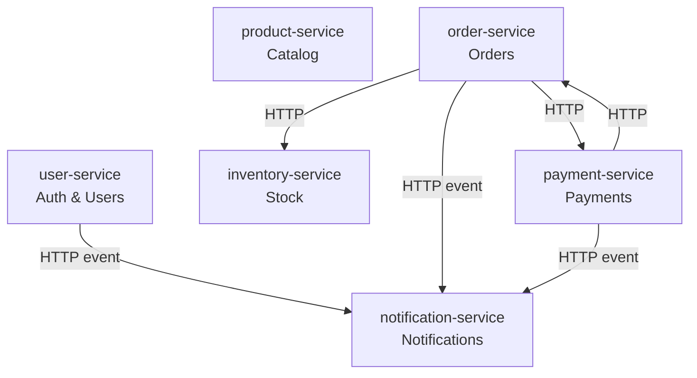

# E-Commerce Microservice Architecture

## Architecture Diagram

## Service Catalog

| Name | Responsibility | Database | Communication |
|------|---------------|----------|--------------|
| user-service | User registration, authentication, profile management | users_db | HTTP + async events |
| product-service | Product catalog, search, category management | products_db | HTTP |
| inventory-service | Stock management, reservation, availability checks | inventory_db | HTTP |
| order-service | Order creation, tracking, cancellation | orders_db | HTTP + async events |
| payment-service | Payment processing, refunds | payments_db | HTTP + async events |
| notification-service | Email and push notifications | notifications_db | async events |

## API Boundaries

- **user-service**: Owns user identity. Emits `user.registered` event consumed by notification-service.
- **product-service**: Read-heavy catalog service. No dependencies on other services.
- **inventory-service**: Owns stock levels. Called synchronously by order-service for reservations.
- **order-service**: Orchestrates checkout. Calls inventory-service (reserve), payment-service (charge), and emits `order.created` to notification-service.
- **payment-service**: Processes charges and refunds. Calls back to order-service on completion and emits `payment.completed` event.
- **notification-service**: Pure consumer. Subscribes to events from user, order, and payment services. No outbound calls.
