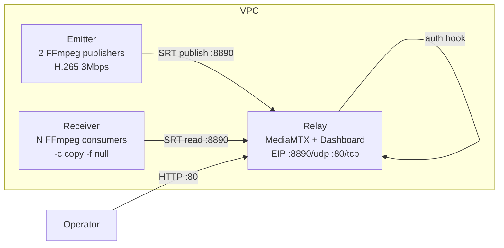

# SRT Distribution — Terraform

[](https://terraform.io)
[](https://www.huaweicloud.com)
[](LICENSE)

## Descripción

Provisiona un **PoC completo de distribución de video SRT** en Huawei Cloud con Terraform: un relay (MediaMTX + dashboard), un emisor (2 publicadores FFmpeg) y un receptor (N consumidores FFmpeg), con **blacklisting individual por cliente** mediante un HTTP auth hook.

### Arquitectura



El **relay** ejecuta [MediaMTX](https://github.com/bluenviron/mediamtx) en modo SRT pass-through con un HTTP auth hook. Un backend FastAPI proporciona:

- `/auth` — MediaMTX lo llama en cada lectura SRT; devuelve 403 para clientes en blacklist.
- `/api/clients` — lista de clientes en vivo (bitrate, loss, uptime) desde la API de control de MediaMTX.
- `/api/blacklist` — GET/POST/DELETE para gestionar la blacklist (persistida en `blacklist.json`).
- `/api/preview/{channel}` — preview MJPEG vía FFmpeg.
- `/` — dashboard UI (single-page, dark theme).

El **emisor** ejecuta 2 publicadores FFmpeg (`testsrc2`, `smptebars`) codificando H.265 a 3 Mbps hacia el relay vía SRT, con auto-reconnect.

El **receptor** ejecuta N consumidores FFmpeg (la mitad por canal) pulling desde el relay vía SRT con `-c copy -f null`, con auto-reconnect.

## Prerrequisitos

- **Terraform** >= 1.5
- Una cuenta de **Huawei Cloud** con credenciales AK/SK
- Una clave pública SSH

## Uso

```bash
# 1. Copiar y completar variables
cp terraform.tfvars.example terraform.tfvars
#    Setear: huaweicloud_access_key, huaweicloud_secret_key, ecs_password, ssh_public_key

# 2. Init + plan + apply
terraform init
terraform plan
terraform apply

# 3. Abrir el dashboard
#    El output `dashboard_url` da la URL (http://<relay-eip>)
```

## Variables

| Variable | Descripción | Tipo | Default |
|----------|-------------|------|---------|
| `huaweicloud_access_key` | Huawei Cloud AK | string | — (sensitive) |
| `huaweicloud_secret_key` | Huawei Cloud SK | string | — (sensitive) |
| `huaweicloud_region` | Región de Huawei Cloud | string | `la-south-2` |
| `ecs_password` | Password root para todas las ECS | string | — (sensitive) |
| `ecs_flavor_id` | Flavor ID de ECS | string | `c6.xlarge.2` |
| `image_name` | Nombre de imagen OS | string | `Ubuntu 22.04 server` |
| `availability_zone` | AZ (null = auto) | string | `null` |
| `ssh_public_key` | Clave pública SSH | string | — |
| `ssh_source_cidr` | CIDR para acceso SSH | string | `0.0.0.0/0` |
| `project_name` | Prefijo de nombres de recursos | string | `srt-poc` |
| `vpc_cidr` | CIDR del VPC | string | `10.0.0.0/24` |
| `consumer_count` | Cantidad de consumidores SRT | number | `100` |
| `srt_latency_us` | Latencia SRT (us) | number | `2000000` |
| `swr_org` | Nombre de org SWR | string | `srt-poc` |
| `dashboard_title` | Título del dashboard | string | `SRT Distribution Control` |

> `ecs_flavor_id` varía por región y disponibilidad — verificar el listado de flavors para tu región.

## Outputs

| Output | Descripción |
|--------|-------------|
| `relay_public_ip` | IP pública del relay |
| `dashboard_url` | URL del dashboard (`http://<relay-eip>`) |
| `relay_private_ip` | IP privada del relay |
| `emitter_private_ip` | IP privada del emisor |
| `receiver_private_ip` | IP privada del receptor |
| `srt_url` | URL del listener SRT |

## Cómo funciona el blacklisting

1. Cada consumidor SRT se conecta con un `streamid` como `read:canal1:op001` — el último segmento es el **client ID**.
2. MediaMTX llama al hook `/auth` en cada conexión de lectura.
3. Si el client ID está en `blacklist.json`, el hook devuelve 403 y la conexión se rechaza.
4. El botón **Block** del dashboard POSTea a `/api/blacklist/{id}`, que también desconecta clientes activos vía la API de control de MediaMTX.
5. La blacklist persiste entre reinicios en `blacklist.json`.

## Estructura de archivos

```
.
├── main.tf                  # Provider + locals
├── variables.tf             # Todas las variables de entrada
├── outputs.tf               # Dashboard URL, IPs
├── network.tf               # VPC, subnet, secgroup, keypair
├── compute.tf               # 3 ECS instances + EIP
├── scripts/
│   ├── relay-init.sh.tpl    # Relay cloud-init (Docker, MediaMTX, dashboard)
│   ├── emitter-init.sh.tpl  # Emitter cloud-init (FFmpeg, publishers)
│   ├── receiver-init.sh.tpl # Receiver cloud-init (FFmpeg, consumers)
│   └── index.html           # Dashboard UI
├── terraform.tfvars.example # Variables de ejemplo
├── Makefile                 # Atajos de ejecución
└── README.md
```

## Limpieza

```bash
terraform destroy
```

## Licencia

MIT
